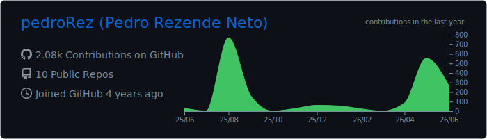
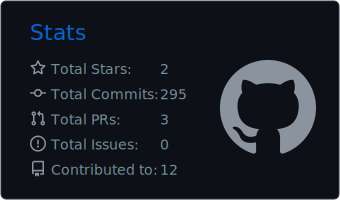
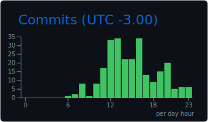
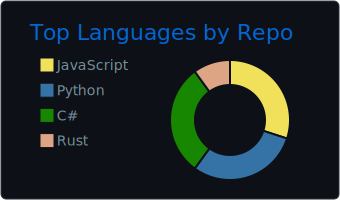
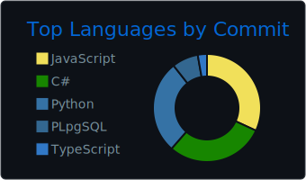

# Pedro Rezende Neto

**Desenvolvedor Full Stack | Agro Digital | Geotecnologias | Web, Mobile & Desktop**

  
  
  
  

  
  
  

---

## Sobre mim

Sou desenvolvedor Full Stack com experiência em sistemas web, desktop, bancos de dados e integrações. Já atuei com software corporativo, geoprocessamento, auditoria pública e soluções para o agro digital.

Gosto de construir ferramentas que resolvem problemas reais: importadores de dados, sistemas internos, apps mobile, painéis web, automações, processamento de mídia e soluções que conectam banco, API, interface e infraestrutura.

- Base em **React, Node.js, .NET/C#, Delphi, Python e TypeScript**.
- Experiência com **PostgreSQL/PostGIS, SQL Server, MongoDB, Firebase, Firebird e SQLite**.
- Vivência com **ArcGIS, serviços web de mapas, dados geográficos e rotinas de back-office**.
- Interesse forte por **redes, streaming, monitoramento, integrações e sistemas distribuídos**.

---

## Stack principal

### Linguagens e runtime

### Frontend, mobile e desktop

### Backend, dados e infraestrutura

### Bancos, dados e GIS

---

## Projetos em destaque

| Projeto | O que entrega | Stack |
| --- | --- | --- |
| [OpenDesk](https://github.com/pedroRez/OpenDesk) | Marketplace/MVP para aluguel de PCs remotos, com foco em sessão, host/cliente, relay, streaming próprio e coordenação de conexões. | TypeScript, Next.js, Fastify, Prisma, PostgreSQL, Rust, Tauri/Electron |
| Xerife ERP | ERP em evolução para gestão de locação de máquinas, oficina, processos internos, dados operacionais e rotinas de back-office. | Web, banco de dados, integração, automação |
| [ImportDataDB](https://github.com/pedroRez/ImportDataDB) | Aplicação desktop para importar planilhas Excel, mapear colunas e levar dados para tabelas de banco com mais controle. | Python, PySide6/Qt, PostgreSQL, Inno Setup |
| [CountG](https://github.com/pedroRez/CountG) + [CountGFront](https://github.com/pedroRez/CountGFront) | Contagem e rastreamento de objetos/bovinos por imagem ou vídeo, com backend de IA, app mobile e [demo disponível](https://drive.google.com/file/d/1QOejW5SMHCNknMpC-f6mGNzqf4nHoud0/view?usp=drive_link). | FastAPI, YOLOv8, Python, React Native, Expo, Docker |
| [NetworkMonitor](https://github.com/pedroRez/NetworkMonitor) | MVP para monitoramento de rede local com cadastro de dispositivos, métricas de tráfego e integração planejada via SNMP. | FastAPI, SQLAlchemy, PostgreSQL, React, Vite |
| [ManipuladorFotos](https://github.com/pedroRez/ManipuladorFotos) | Aplicativo desktop para organizar fotos/vídeos, identificar duplicadas/semelhantes e revisar exclusões com segurança. | C#, .NET 8, WPF, MVVM |
| [GravadorDeTela](https://github.com/pedroRez/GravadorDeTela) | Ferramenta de gravação de tela pensada para computadores modestos, usando FFmpeg e fluxo simples de captura. | C#, .NET Framework, FFmpeg |
| App multimídia | Aplicativo para livros, vídeos e fotos, explorando experiência web/mobile e manipulação de mídia com React e Expo. | ReactJS, React Native, Expo |

### Painel rápido

| Produto | Status | Por que é importante |
| --- | --- | --- |
| **OpenDesk** | Foco atual | Produto com backend, web, desktop, sessão remota, rede e streaming próprio. |
| **Xerife ERP** | Foco atual | Sistema de gestão para locação, oficina, processos internos e controle operacional. |
| **CountG** | Projeto IA/mobile | Une visão computacional, FastAPI, React Native, Expo e processamento de vídeo. |
| **ImportDataDB** | Ferramenta desktop | Resolve fluxo real de importação, mapeamento e carga de dados em banco. |

---

## Dados, redes e integrações

Tenho trabalhado bastante na parte que fica entre interface, API, banco e infraestrutura:

- Modelagem e integração com **PostgreSQL, SQL Server, MongoDB, Firebase, Firebird e SQLite**.
- Dados geográficos com **PostGIS, ArcGIS, mapas web e publicação de serviços geoespaciais**.
- Importação e transformação de dados a partir de **Excel, arquivos `.DAT`, APIs e rotinas de back-office**.
- Monitoramento e redes com **IP local, CORS, credenciais de roteador, SNMP, Ngrok e comunicação entre app mobile e backend local**.
- Estudos e projetos envolvendo **streaming de vídeo/áudio, input remoto, relay, sessão, LAN e arquitetura host/cliente**.

---

## GitHub em números

  

### Resumo unificado

> Os cards de resumo abaixo são gerados pela mesma rotina para que commits, horários e linguagens usem uma única base de contagem. Quando o token do workflow tem acesso aos repositórios privados, a atividade entra de forma agregada, sem expor nomes, links ou código dos repositórios.

  

  

<table align="center">
  <tr>
    <td align="center">
      
    </td>
    <td align="center">
      
    </td>
  </tr>
  <tr>
    <td align="center">
      
    </td>
    <td align="center">
      
    </td>
  </tr>
</table>

---

## Onde estou focando agora

- Evoluir o **OpenDesk** como produto com backend, web, desktop, sessão remota e base de conexão própria.
- Desenvolver o **Xerife ERP** para gestão de locação, oficina, processos internos e dados operacionais.
- Aprofundar arquitetura de **redes, streaming, monitoramento, banco de dados e integrações**.
- Transformar ideias práticas em sistemas usáveis, documentados e fáceis de operar.

---

**Aberto a trocar ideia sobre projetos, produtos, automação, dados, agro digital e software que resolve problema real.**

